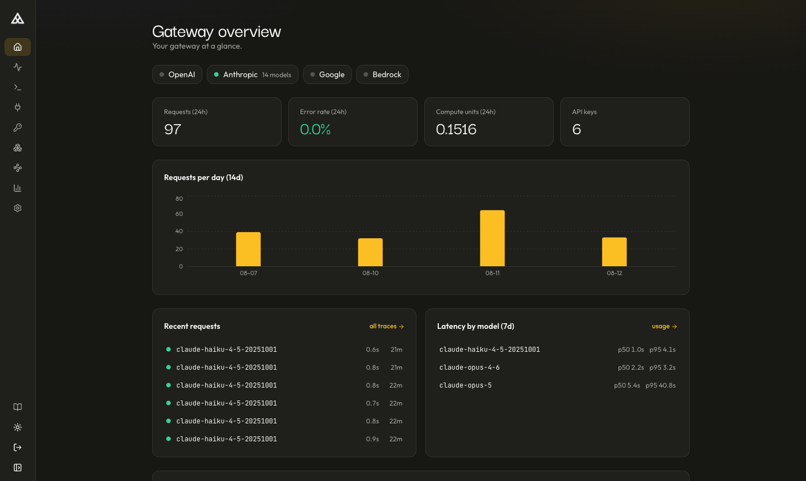

# MLPal Gateway

[](https://pypi.org/project/mlpal-gateway/)
[](LICENSE)
[](https://github.com/mlpalOld/mlpal-gateway/actions/workflows/ci.yml)

A self-hostable AI gateway. One API and one key for Anthropic, OpenAI, Google,
and AWS Bedrock, with model routing, per-request cost metering, per-key access
control, and an admin console. Runs locally with a single `docker compose up`.



## What it does

- **One API, four providers.** Send Anthropic-wire requests to
  `POST /v1/messages` for any served model; the gateway translates to each
  provider's native API and relays the stream unmodified. OpenAI-compatible
  endpoints (`/v1/chat/completions`, `/v1/embeddings`, images, audio) work with
  existing OpenAI SDK code.
- **Router tags.** Send `"model": "mlpal"` (or `mlpal-flash`, `mlpal-lite`) and
  the gateway resolves it to the best model your deployment can serve, walking a
  curated candidate list that spans providers. When a model is retired or a
  provider key is missing, resolution falls through to the next candidate — your
  code never changes.
- **Cost on every response.** Each request is metered in compute units
  (1 CU = $10 of provider list price, no markup) and returned in an
  `X-MLPal-Compute-Units` header. The meter reproduces provider list pricing
  exactly, including prompt-cache discounts — verified end-to-end in the
  [technical report](paper/mlpal-gateway-technical-report.pdf).
- **Per-key control.** Keys carry model-policy globs (`allow: ["claude-*"]`),
  multi-window spend budgets, and permissions. All checks run at admission,
  before the provider call; a running stream is never cut.
- **Observability.** Per-key cache hit rate, latency p50/p95, time-to-first-token,
  request traces, and optional request/response payload capture
  (zlib-compressed, runtime-toggleable — it is your box and your data).
- **Provider semantics preserved.** Prompt caching (`cache_control`), tools,
  structured output, and MCP server config pass through to the provider
  untouched. Measured: a 22k-token cached prefix writes once and reads on every
  subsequent call, through the gateway, exactly as it does against the provider
  directly.

## Quick start

```bash
cp .env.oss.example .env      # add whichever provider keys you have
docker compose up             # Postgres + Redis + gateway + admin console
```

- Gateway: `http://localhost:8000` (Swagger at `/docs`)
- Admin console: `http://localhost:8080`
- The seed prints a one-time bootstrap admin key: `docker compose logs seed`

Adapters activate based on which provider keys you set. `GET /v1/models` lists
only what your box can actually serve; router tags resolve against that same
set, so a single-provider deployment works without configuration.

## Calling it

Anthropic wire (any provider's model):

```bash
curl http://localhost:8000/v1/messages \
  -H "Authorization: Bearer $MLPAL_KEY" -H "content-type: application/json" \
  -d '{"model":"mlpal","max_tokens":512,"messages":[{"role":"user","content":"hi"}]}'
```

Existing OpenAI SDK code — point it at `http://localhost:8000/v1`.

Python SDK ([`mlpal-assistants`](https://pypi.org/project/mlpal-assistants/),
[source](https://github.com/mlpalOld/mlpal-assistants-sdk)):

```bash
pip install mlpal-assistants
```

```python
from mlpal_assistants import MLPal

client = MLPal(base_url="http://localhost:8000")   # MLPAL_API_KEY from env
msg = client.messages.create(
    model="mlpal", max_tokens=512,
    messages=[{"role": "user", "content": "Hello"}],
)
print(msg.text, msg.compute_units)
```

## Router tags vs. catalog

Two ways to use the curated model set. They differ in who picks the model:

| | Router tags (`mlpal`, `mlpal-flash`, `mlpal-lite`) | Catalog (`GET /v1/catalog`) |
|---|---|---|
| Who decides | The gateway. The tag resolves to the best model your deployment serves for that operation. | Your client. A ranked list with tiers, capabilities, and per-token rates. |
| Use when | You want a good default and no model-name maintenance. | You are writing routing logic (agents route sub-tasks this way). |
| Single-provider box | Resolution falls through to whatever your key serves. | Unserved candidates are marked; pick among the rest. |

Both are driven by the same data feed (`catalog/*.json`) and updated as data,
not code.

## Why a curated catalog

Most gateways list as many models as possible (OpenRouter ~400, Portkey ~1,600).
This gateway serves a curated set (~75 models) instead, for a measured reason:
production models now retire on roughly a 12-month cycle, and serving a model
well — valid parameter ranges, per-model cache minimums, reasoning budgets,
provider quirks — is per-model engineering that does not scale to thousands of
entries. The data and the argument are in the technical report:

- **[Curation Over Breadth](paper/mlpal-gateway-technical-report.pdf)** — model
  retirement data from provider deprecation ledgers, gateway-overhead benchmarks
  (vs. direct API and a LiteLLM proxy), cache and metering fidelity
  measurements, and a feature comparison. Reproduction harness and raw results
  in [`paper/bench/`](paper/bench/).
- [docs/POSITIONING.md](docs/POSITIONING.md) — feature matrix vs. OpenRouter /
  LiteLLM / Portkey, including where they are ahead.

You can always pin any explicit model tag, and you can register your own
adapter.

## API surface

Data plane under `/v1` (a version is a contract revision, never a wire dialect):

| Endpoint | Purpose |
|---|---|
| `POST /v1/messages` | Anthropic-wire inference, all providers, streaming SSE |
| `POST /v1/chat/completions` | OpenAI-compatible chat |
| `/v1/embeddings`, `/v1/images/generations`, `/v1/audio/*` | OpenAI-compatible modalities |
| `GET /v1/models` | Models this deployment serves |
| `GET /v1/catalog` | Ranked catalog: tiers, capabilities, rates |
| `POST /v1/feedback` | Outcome feedback for routing scores |
| `GET /v1/usage/*`, `/v1/keys/*` | Self-scoped usage, traces, key stats |
| `/admin/v1/*` | Management: keys, policies, budgets, capture, routing |

Details: [docs/API_SURFACE.md](docs/API_SURFACE.md).

## Repository layout

```
src/                 # FastAPI gateway: adapters, services, api, seams
console/             # admin UI (React + Vite): keys, traces, catalog, usage
docker-compose.yaml  # one-command local deployment
alembic/             # database migrations
paper/               # technical report + benchmark harness
enterprise/          # commercial add-ons (separate license, NOT Apache)
docs/                # API surface, positioning
```

The managed MLPal service runs this same codebase. Deployment differences live
behind composition-root seams (`api/mounting.py`): auth backend, billing
backend, capture defaults. The open-source defaults (`MLPAL_AUTH_BACKEND=local`,
`MLPAL_BILLING_BACKEND=local`) run standalone; `src/` never imports from
`enterprise/`.

## Using it with a coding agent

[Yodex](https://www.npmjs.com/package/@mlpal/yodex) is our coding CLI. It
speaks the Anthropic wire to the gateway and uses `GET /v1/catalog` to route
sub-tasks to cheaper models, which cut sub-agent cost about 10× in our
benchmarks ([details](https://github.com/mlpalOld/yodex)):

```bash
npm install -g @mlpal/yodex
export YODEX_GATEWAY_URL=http://localhost:8000
export YODEX_API_KEY=mlpal_sk_...    # minted in the console
yodex "fix the failing test"
```

## Self-hosted vs. managed

The open-source gateway is fully functional with your own provider keys and has
no fees. The managed service (same code, our keys) adds hosted operation and
the platform layers above the gateway. See [enterprise/](enterprise/README.md).

## License and contact

Apache-2.0, except the `enterprise/` directory (commercial, see
[`enterprise/LICENSE`](enterprise/LICENSE)). Contributions welcome:
[CONTRIBUTING.md](CONTRIBUTING.md). Security reports and everything else:
**contact@mlpal.ai**.
